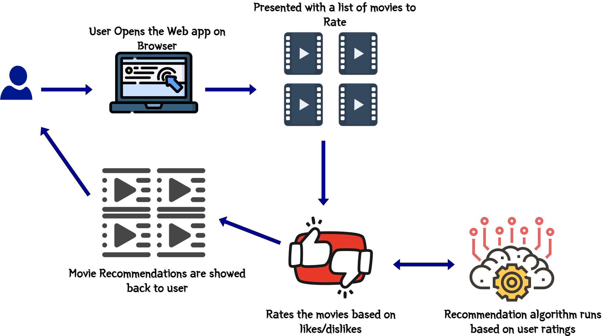
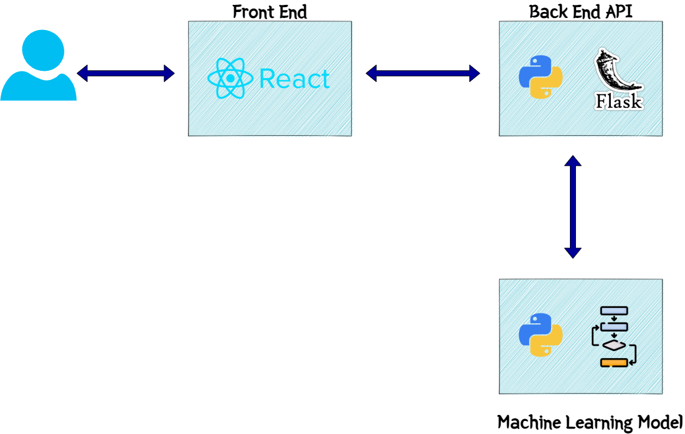
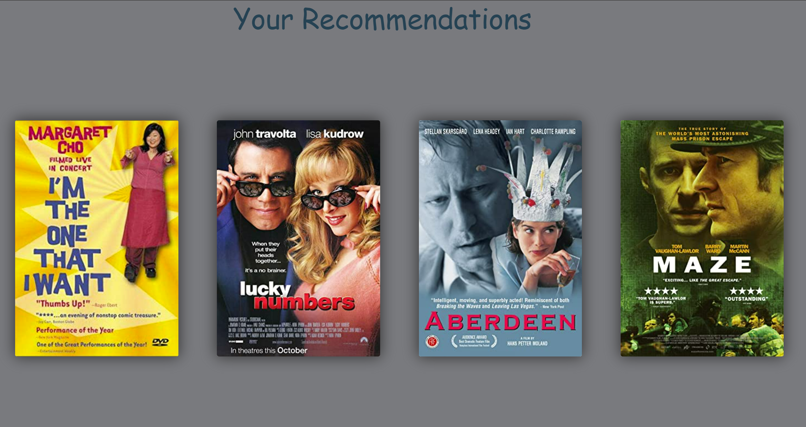
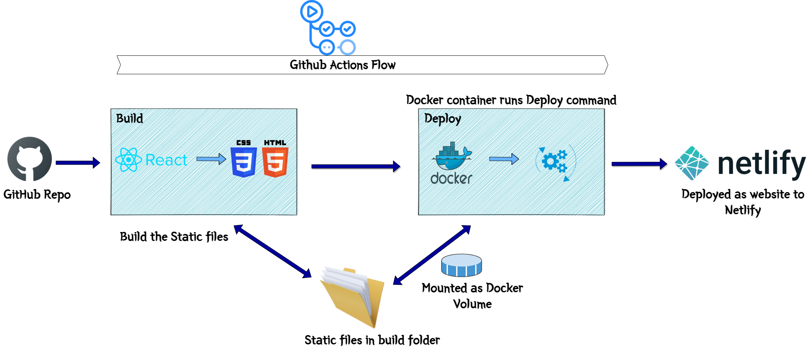
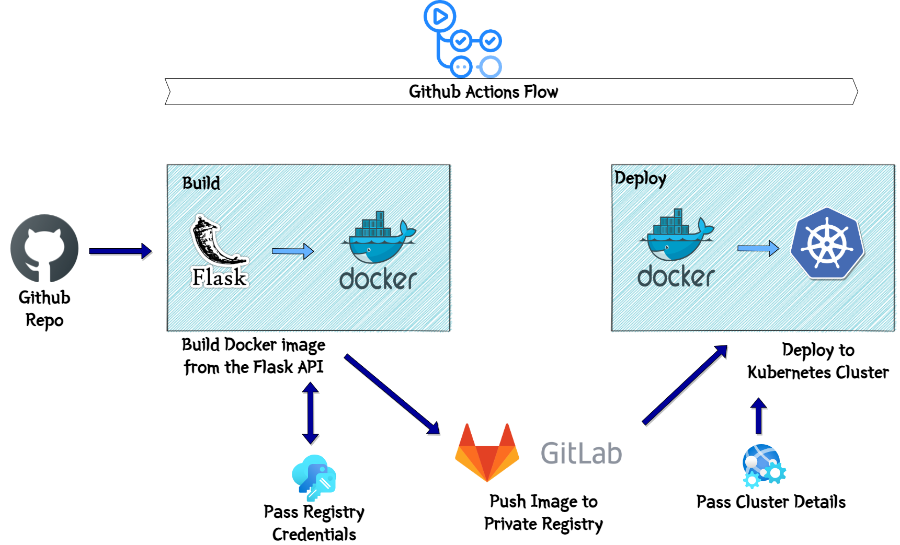

# A Movie Recommender Engine using K-Means and Collaborative Filtering  

This post describes about how I built a Movie recommender system (similar to Netflix). I built this system in response to the Cloud Challenge from Acloudguru. But then I thought why not have an end to end implementation of the system along with a Web app and a CI/CD deployment process to deploy the Machine learning model. Hopefully I will be able to help someone learn the concepts and fulfill the challenge requirements too. This is my first attempt on building something based on Machine learning so I apologize if there are some gaps in my understanding of the algorithms and how its executed.  

At high level a movie recommender system is just what the name says. It will recommend you movies to watch based on your previous likes and dislikes. From end user perspective that's how simple it is. But in backend there are multiple algorithms and scripts in play to generate the recommendations. I will be going through an algorithm in this post, which I built for the system. I will go into more detail about the recommender system in post below.

This will be a highly technical post and I will try to explain the functional components in detail. All the code files are available on my GitHub repo:  <a href="https://github.com/amlana21/ml-challenge-publish" target="_blank">Here</a>  

## Demo App  

I have deployed a demo app to show a sample of how the algorithm will work and show recommendations. The demo can be accessed <a href="https://amlansmlchallenge.ml" target="_blank">Here</a>.  

Few points about the demo:  
- Since I am using free tier for each components, I couldnt give great capacity to the web app backend. So the app may behave slow for some of you  
- Due to low capacity the data used for the algorith is also not a very big dataset. So the recommendations may not be that accurate. But the backend ML algorthm is the same as I describe below  
- I am using Collaborative filtering method for the backend API to provide recommendations

## Pre-Requisites  
There are few pre-requisites which I had to take care to complete this setup and overall understand the process. If you want to setup and deploy this model, you will have to make sure these are available to you:  
- A Kubernetes cluster  
- An AWS account (free tier should be enough)  
- Some high level understanding of Machine learning  
- Some AWS understanding  

## What Did I Build  

Let me explain about what I built here. It is a simple movie recommender system where it will recommend you movie names based on how you rated other movies. It is similar to the Netflix system where you see recommended movies once you log in to Netflix, but it is not as complicated as that. This image will show overall what happened functionally with the app when user opens it to view recommendations.  
   

This is what the recommender will perform functionally when an user opens and tries to get a recommendation:  
- User opens the web app frontend  
- User is presented with a list of movies to rate  
- User selects appropriate ratings on those movies based on likes and dislikes  
- Once the ratings are submitted, a loading screen is presented to denote that the backend Machine learning model is at work to identify the recommendations  
- Once done, user is presented back with few movies as recommendations based on the ratings given on the earlier screen  

Now I have tried to keep the model as accurate as possible but based on the data set I had, I agree some recommendation outcomes you may not agree with but please bear with it. 

To make this work, there are two components which I built. Below image will give an overall idea of the components and how they interact.  

    

Let me go through each component and explain what they do.  

  ### Web App  
  This is the front end of the system. I built a REACT web app to serve as the front end to users and show the recommendations to the users. The frontend calls the backend API endpoints for various processing tasks. I will come to the API details in next section. This is a simple React app with the API details passed as environment variables. These are the overall functions happening on the front end:  

      
      

  - When you open the app you are presented with few movies to rate on  
  - You cycle through the movies and rate each one based on your likes or dislikes  
  - On Final step, you submit the ratings  
  - The React app calls the API endpoint and passes rating details with payload  
  - API responds back with the recommendations  
  - The React app parses the response and displays the recommendation back to the user

  ### Backend API  
  This is the actual processing component of the whole system architecture. The backend API handles all data processing, machine learning model execution etc. to finally give the recommendation as output. It is a Flask API using Python. It exposes various endpoints for the different tasks. One important endpoint is the get recommendation endpoint. Now in my code there are two endpoints for the recommendation since I built the recommendation engine using two types of Machine learning algorithms(more on that later). So based on which algorithm is called, there is separate endpoint for each.  
  - <em>/getrecomcollab: </em>This is the endpoint which calls the Collaborative filtering algorithm to get the recommendation outputs  
  - <em>/getrecom: </em>This is the endpoint which calls the K-Means algorithm to provide the recommendation outputs  

  To get the images for the movies, I am using OMDB API <a href="https://www.omdbapi.com/" target="_blank">Here</a>

  Overall these are the steps performed by the API once invoked by the frontend:  
  - Get the input rating and movie details as the POST body of the API call  
  - Load the data files as data frames for the algorithm execution  
  - Pass the input data to the ML algorithm and run the algorithm with this data  
  - Call OMDB API to get the movie images
  - Get the output and send back the output as JSON response to the front end

  ### ML Model  
  This is actual "brain" of the process. This is the actual Machine learning algorithm which runs and provides the recommendations based on rating inputs. I have developed two algorithms to demonstrate two ways of clustering the data and recommending based on that. But for the web app, I am using the Collaborative Filtering algorithm to provide the recommendation outputs. Still trying to tune the K-Means model to provide faster responses via the API. I will be discussing the models in detail in next section.  

## How Did I Build  

Below sections describe the two approaches for my recommender algorithms. I have embedded the Jupyter notebooks which goes through both of the processes. 

  ### The Dataset  
  First let me explain a bit about the dataset I am using. The dataset used in my algorithm is from MovieLens. It provides the data files for movies and ratings for those movies as provided by various users. The dataset details can be found <a href="https://grouplens.org/datasets/movielens/" target="_blank">Here</a>. The data is divided in two files:  
  - <em>movies.csv: </em>List of all movies and corresponding genres  
  - <em>ratings.csv: </em>List of all ratings rated by various users along with user ids

  ### K-Means Algorithm  
  <iframe src='https://amlans-ml-challenge.netlify.app/mlchallengekmeans.html' height="1000px" width="100%"></iframe>

  ### Collaborative Filtering Algorithm  
  <iframe src='https://amlans-ml-challenge.netlify.app/mlchallengecollab.html' height="1000px" width="100%"></iframe>

## Deploying the Model and Frontend  
Now lets move on to the deployment part of the whole app along with the ML model. The components are deployed on different services/platforms and all of the deployment steps are being automated by different CI/CD tools. There are two separate deployment pipelines built:  

- A CI/CD pipeline for Front end web app  
- A CI/CD pipeline for the Backend API and the ML model  

Below image will show the overall end to end architecture of the application stack.  
    

Lets get to each of the component deployments one by one.  

  ### Deploy Frontend  
  The Front end is deployed on Netlify. The React web app is built and the final static web files are uploaded to a Netlify website. Netlify is a very good platform to deploy static websites for your personal side projects. Since it has a generic free tier, I used it deploy the front end for this demo app.  
  The deployment to Netlify is automated using GitHub actions. Whenever changes are pushed to the GitHub repo, it triggers a GitHub actions flow to deploy the app to Netlify. To handle the deployment to Netlify, I created a custom docker image which gets the input as the React app static files and uploads to the Netlify website. This is what the custom Docker image does:  
  - Install Netlify CLI  
  - Create folder to host the web app files mapped via volume mounts  
  - Execute bash  
  - The base image is node image  

  Let me go through the deployment flow. This image will show the overall flow steps which happens during the deployment. These are steps handled by the GitHub actions flow.  
       

  - Fetch the React files from the GitHub repo and run 'npm run build' to build the static files from the React app. The files will be available in the Build folder  
  - Launch the docker container with the custom Docker image from above  
  - Volume mount the Build folder to the app folder in the Docker container. This will make the files accessible within the container  
  - Pass the Netlify site and security key details as environment variables to the Docker container  
  - Run the Netlify command to upload the static files to the Netlify site  
  - This will deploy the web app to Netlify  

  Now we should be able to access the frontend page by accessing the Netlify URL. Although things wont quite work yet as we still have to deploy the backend API. Lets get on with the API deployment in next section.  

  ### Deploy API  
  For the Flask API backend, I am deploying the API as a deployment to a Kubernetes cluster. I tried to deploy it as Lambda function but the level of data processing and the algorithm processing, which is happening within the API, I decided to move it to a Kubernetes cluster. I am automating the building and the deployment to the cluster, using GitHub actions. The architecture above also shows all the Kubernetes components deployed.    

  I created a custom Docker image for the API. This launches a container and starts the API within the Docker container. The Dockerfile is part of the GitHub repo. The Docker image has been pushed to my private registry on GitLab and is being pulled from there in the cluster.    
  These are the components which are deployed in the cluster:  
  - <b>Deployment: </b>  
  This the Kubernetes Deployment using the custom API Docker image. It launches the necessary Pods and starts the API containers in them. I am keeping 2 replicas in the Deployment for this demo app.  
  - <b>Load Balancer Service: </b>  
  This is the service to expose the API endpoints to public web. The Load balancer exposes the Deployment and makes the API endpoints accessible via the Load balancer endpoint. Since I need a secure https endpoint so that Netlify front end can access the API endpoint, I am using a free Lets encrypt SSL certificate and applied the same to the Load balancer endpoint. This exposes an https endpoint for the Kubernetes Load balancer service.  
  - <b>Persistent Volume: </b>  
  Since there are some data files and data processing involved within the API, I needed a common storage for all the Pods to access the needed data files. So a Persistent volume is launched and mounted to all of the Pods launched by the Deployment.  
  - <b>Init Container: </b>  
  This is launched one time when the Deployment is launched. Its not a good idea to add the required data files as part of the Docker image. So the container needs the files mounted via a volume. This Init container makes sure that before the Pods are launched, the data files are available at the Persistent volume. I am storing the Data files in AWS S3 and this container pulls the data files from S3. These are the steps which happen:  
    - Before the API Pod containers are launched, the Initcontainer is launched  
    - It is based on the AWS CLI image and runs the command to pull the data files from the specified S3 location  
    - After pulling the files, it stores the files in a location which mounts the same Persistent volume used by the other Pods  
    - Once the API Pods start, they have the files available at the volume to mount  
  - <b>Pod Autoscaler: </b>
  An autoscaler is launched to have a level of elasticity on the pods. Based on the memory and CPU used by the Pods, additional Pods are automatically launched to scale up or Pods are killed to scale down.  
  - <b>Secrets: </b>  
  Some of the parameters are stored in the secret and mounted in the Pods. One of them are the AWS keys. Its being used to pull the data from S3. The keys are stored as Secret.  

  To automate the Deployment I am using GitHub Actions. There are few steps which are handled by the GitHub actions flow. This image explains the same:  
        

  - <b>Build: </b>  
  In this stage, I am building the Docker image from the checked out API files. The docker image gets built and pushed to the private GitLab registry. All the credentials related details are passed as variables to the flow.  
  - <b>Deploy: </b>  
  In this step, the Image which was pushed to the registry, gets pulled from the registry. The Kubernetes cluster details are passed environment variables. The kubectl apply command is executed to deploy the Kubernetes components to the cluster. This completes the deployment of the API.  

  Once it is deployed, I can get the endpoint from the load balancer and quickly hit the endpoint to get a successful response and confirm successful deployment.  
  From infra perspective, I launched a Kubernetes cluster on Linode. It had a promotion of $100 credits to new users. I am using the same to launch a Kubernetes cluster.  

## Conclusion  
This concludes my version of the Movie recommender system. Hopefully I was able to meet the challenge requirements and build an useful model for others to learn from. I added the sample app and the deployment method too to help someone understand a ML model deployment and host via API. Let me know if you have any questions or there are any issues in any part of my implementation.    